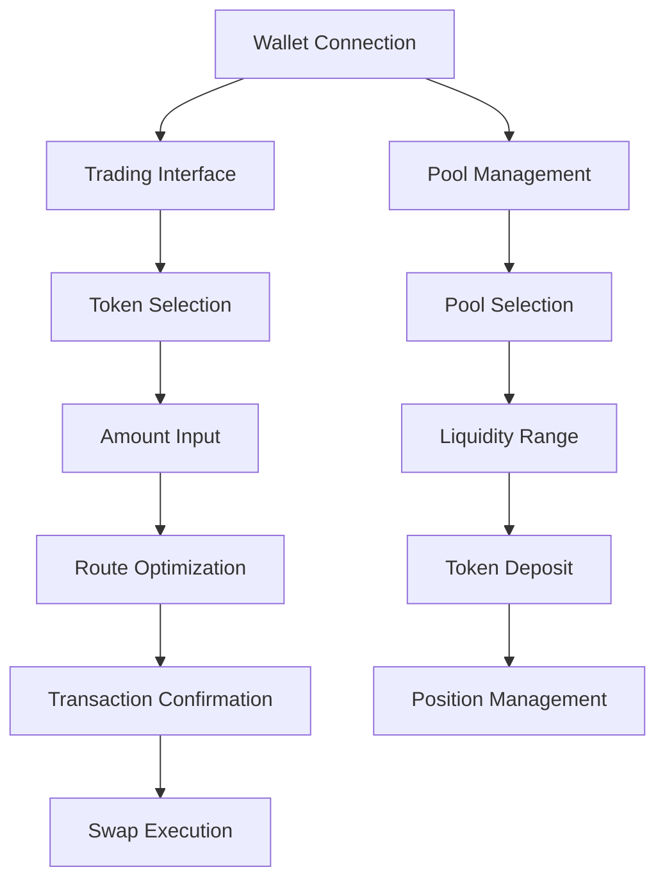

## 1. Product Overview

AetherDEX is a next-generation decentralized exchange platform built on Ethereum and compatible L2 networks, featuring concentrated liquidity, advanced routing algorithms, and cross-chain interoperability. The platform combines sophisticated smart contract architecture with modern web technologies to provide optimal trading experiences for DeFi users.

The project addresses capital inefficiency in traditional AMMs through concentrated liquidity provision, while offering advanced features like multi-hop swaps, optimal path finding, and extensible hook architecture for customizable trading logic.

## 2. Core Features

### 2.1 User Roles

| Role | Registration Method | Core Permissions |
|------|---------------------|------------------|
| Trader | Wallet connection (MetaMask, WalletConnect) | Execute swaps, view prices, access trading interface |
| Liquidity Provider | Wallet connection with token approval | Provide liquidity, earn fees, manage positions |
| Developer | Smart contract interaction | Deploy hooks, integrate APIs, access advanced features |

### 2.2 Feature Module

Our AetherDEX platform consists of the following main pages:

1. **Trading Interface**: Token swap functionality, price quotes, slippage protection
2. **Pool Management**: Liquidity provision, position management, fee collection
3. **Portfolio Dashboard**: Trading history, position tracking, P&L analysis
4. **Explorer**: Pool discovery, analytics, market data
5. **Developer Console**: API documentation, smart contract interfaces, integration tools

### 2.3 Page Details

| Page Name | Module Name | Feature description |
|-----------|-------------|---------------------|
| Trading Interface | Swap Engine | Execute token swaps with optimal routing, multi-hop support, slippage protection, real-time price quotes |
| Trading Interface | Token Selector | Browse and select from supported tokens, view balances, search functionality |
| Trading Interface | Price Display | Show current prices, price impact, exchange rates, historical data |
| Pool Management | Liquidity Provision | Add/remove liquidity, concentrated liquidity ranges, fee tier selection |
| Pool Management | Position Management | View active positions, collect fees, adjust ranges, position analytics |
| Portfolio Dashboard | Trading History | Display past transactions, filter by date/token, export functionality |
| Portfolio Dashboard | Analytics | Show P&L, performance metrics, portfolio composition |
| Explorer | Pool Discovery | Browse available pools, filter by TVL/volume, pool statistics |
| Explorer | Market Data | Real-time market data, charts, trading volume, liquidity metrics |
| Developer Console | API Documentation | REST and WebSocket API docs, code examples, authentication |
| Developer Console | Smart Contract Interface | Contract addresses, ABI, integration guides, hook development |

## 3. Core Process

**Trader Flow:**
Users connect their wallet, select input/output tokens, specify amounts, review swap details including price impact and fees, confirm transaction, and receive tokens with transaction confirmation.

**Liquidity Provider Flow:**
Providers connect wallet, select token pair, choose fee tier, set price range for concentrated liquidity, deposit tokens, receive LP tokens, and can later collect fees or adjust positions.

**Developer Integration Flow:**
Developers access API documentation, obtain authentication credentials, integrate trading functionality, deploy custom hooks, and monitor usage through analytics dashboard.

## 4. User Interface Design

### 4.1 Design Style

- **Primary Colors**: Deep blue (#1a1b3a) and bright green (#00ff88) for AetherDEX branding
- **Secondary Colors**: Gray scale (#f8f9fa to #212529) for backgrounds and text
- **Button Style**: Rounded corners (12px), gradient backgrounds, hover animations
- **Typography**: Inter font family, 16px base size, bold headings
- **Layout Style**: Card-based design, top navigation, responsive grid system
- **Icons**: Lucide React icons, consistent 24px sizing, outlined style

### 4.2 Page Design Overview

| Page Name | Module Name | UI Elements |
|-----------|-------------|-------------|
| Trading Interface | Swap Card | Centered card layout, token input fields, swap button, dark theme with green accents |
| Trading Interface | Header | Fixed navigation, wallet connection button, theme toggle, trade dropdown menu |
| Trading Interface | Background | Animated token symbols, subtle gradients, responsive design |
| Pool Management | Pool Cards | Grid layout, pool statistics, action buttons, progress indicators |
| Portfolio Dashboard | Charts | Interactive price charts, portfolio pie charts, performance graphs |
| Explorer | Data Tables | Sortable tables, search filters, pagination, real-time updates |

### 4.3 Responsiveness

The platform is mobile-first responsive, optimizing for touch interactions on mobile devices while providing full desktop functionality. Breakpoints at 768px (tablet) and 1024px (desktop) ensure optimal viewing across all devices.