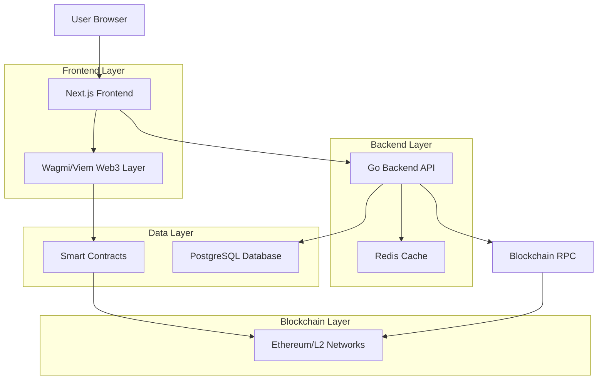
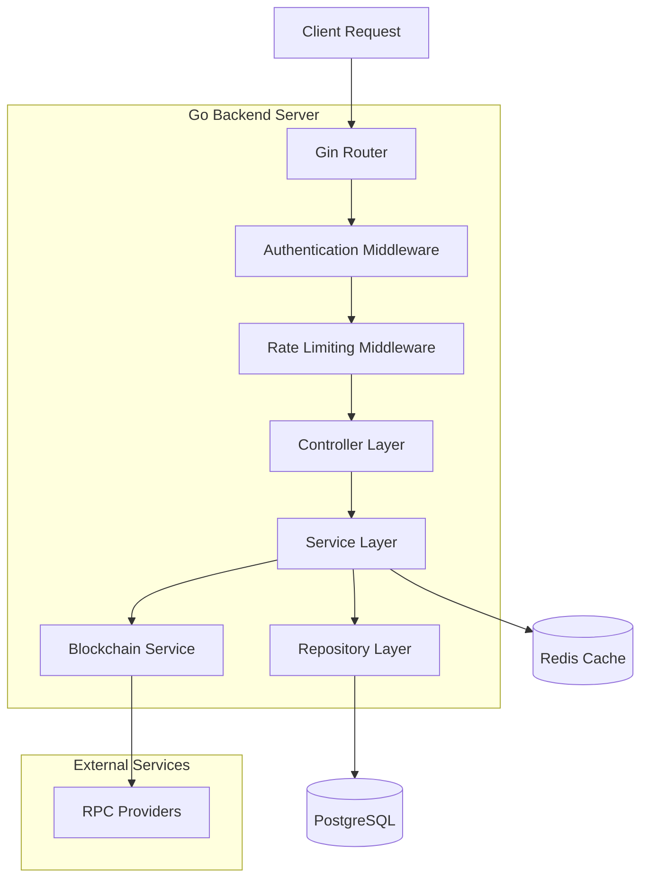
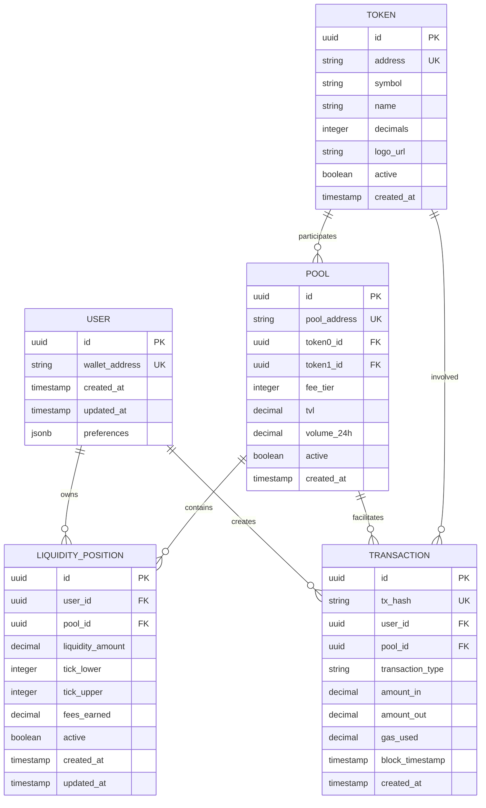

## 1. Architecture Design



## 2. Technology Description

- **Frontend**: Next.js@15.4.6 + React@19 + TypeScript + Tailwind CSS@4.1.12 + Wagmi@2.16.3 + Viem@2.33.3
- **Backend**: Go@1.25 + Gin Framework + GORM + Redis + PostgreSQL
- **Smart Contracts**: Solidity@0.8.24 + Foundry + Uniswap V4 Core + OpenZeppelin
- **Package Manager**: Bun@1.2.20
- **Infrastructure**: Docker + Nginx + Monitoring Stack

## 3. Route Definitions

| Route | Purpose |
|-------|---------|
| / | Main trading interface with swap functionality |
| /trade/swap | Token swap interface (default) |
| /trade/limit | Limit order placement |
| /trade/buy | Direct token purchase |
| /trade/send | Token transfer functionality |
| /pools | Liquidity pool management |
| /portfolio | User portfolio and trading history |
| /explore | Pool discovery and market analytics |

## 4. API Definitions

### 4.1 Core API

**Authentication**
```
POST /api/v1/auth/nonce
```
Request:
| Param Name | Param Type | isRequired | Description |
|------------|------------|------------|-------------|
| address | string | true | Wallet address for authentication |

Response:
| Param Name | Param Type | Description |
|------------|------------|-------------|
| nonce | string | Random nonce for signature |
| expires_at | timestamp | Nonce expiration time |

**Token Information**
```
GET /api/v1/tokens
```
Response:
| Param Name | Param Type | Description |
|------------|------------|-------------|
| tokens | array | List of supported tokens with metadata |
| total_count | integer | Total number of supported tokens |

**Price Quotes**
```
GET /api/v1/quote
```
Request:
| Param Name | Param Type | isRequired | Description |
|------------|------------|------------|-------------|
| tokenIn | string | true | Input token address |
| tokenOut | string | true | Output token address |
| amountIn | string | true | Input amount in wei |
| slippage | number | false | Maximum slippage tolerance (default: 0.5%) |

Response:
| Param Name | Param Type | Description |
|------------|------------|-------------|
| amountOut | string | Expected output amount |
| priceImpact | number | Price impact percentage |
| route | array | Optimal routing path |
| gasEstimate | string | Estimated gas cost |

**Pool Information**
```
GET /api/v1/pools
```
Response:
| Param Name | Param Type | Description |
|------------|------------|-------------|
| pools | array | Active liquidity pools |
| tvl | string | Total value locked |
| volume24h | string | 24-hour trading volume |

### 4.2 WebSocket API

**Real-time Price Updates**
```
ws://api.aetherdex.com/ws/prices
```
Subscription Message:
```json
{
  "type": "subscribe",
  "channel": "prices",
  "tokens": ["0x...", "0x..."]
}
```

**Pool Updates**
```
ws://api.aetherdex.com/ws/pools
```
Subscription Message:
```json
{
  "type": "subscribe",
  "channel": "pools",
  "poolIds": ["pool1", "pool2"]
}
```

## 5. Server Architecture Diagram



## 6. Data Model

### 6.1 Data Model Definition



### 6.2 Data Definition Language

**Users Table**
```sql
CREATE TABLE users (
    id UUID PRIMARY KEY DEFAULT gen_random_uuid(),
    wallet_address VARCHAR(42) UNIQUE NOT NULL,
    created_at TIMESTAMP WITH TIME ZONE DEFAULT NOW(),
    updated_at TIMESTAMP WITH TIME ZONE DEFAULT NOW(),
    preferences JSONB DEFAULT '{}'
);

CREATE INDEX idx_users_wallet_address ON users(wallet_address);
CREATE INDEX idx_users_created_at ON users(created_at DESC);
```

**Tokens Table**
```sql
CREATE TABLE tokens (
    id UUID PRIMARY KEY DEFAULT gen_random_uuid(),
    address VARCHAR(42) UNIQUE NOT NULL,
    symbol VARCHAR(20) NOT NULL,
    name VARCHAR(100) NOT NULL,
    decimals INTEGER NOT NULL DEFAULT 18,
    logo_url TEXT,
    active BOOLEAN DEFAULT true,
    created_at TIMESTAMP WITH TIME ZONE DEFAULT NOW()
);

CREATE INDEX idx_tokens_address ON tokens(address);
CREATE INDEX idx_tokens_symbol ON tokens(symbol);
CREATE INDEX idx_tokens_active ON tokens(active);
```

**Pools Table**
```sql
CREATE TABLE pools (
    id UUID PRIMARY KEY DEFAULT gen_random_uuid(),
    pool_address VARCHAR(42) UNIQUE NOT NULL,
    token0_id UUID NOT NULL REFERENCES tokens(id),
    token1_id UUID NOT NULL REFERENCES tokens(id),
    fee_tier INTEGER NOT NULL,
    tvl DECIMAL(36,18) DEFAULT 0,
    volume_24h DECIMAL(36,18) DEFAULT 0,
    active BOOLEAN DEFAULT true,
    created_at TIMESTAMP WITH TIME ZONE DEFAULT NOW()
);

CREATE INDEX idx_pools_address ON pools(pool_address);
CREATE INDEX idx_pools_tokens ON pools(token0_id, token1_id);
CREATE INDEX idx_pools_tvl ON pools(tvl DESC);
CREATE INDEX idx_pools_volume ON pools(volume_24h DESC);
```

**Transactions Table**
```sql
CREATE TABLE transactions (
    id UUID PRIMARY KEY DEFAULT gen_random_uuid(),
    tx_hash VARCHAR(66) UNIQUE NOT NULL,
    user_id UUID NOT NULL REFERENCES users(id),
    pool_id UUID REFERENCES pools(id),
    transaction_type VARCHAR(20) NOT NULL,
    amount_in DECIMAL(36,18),
    amount_out DECIMAL(36,18),
    gas_used DECIMAL(20,0),
    block_timestamp TIMESTAMP WITH TIME ZONE,
    created_at TIMESTAMP WITH TIME ZONE DEFAULT NOW()
);

CREATE INDEX idx_transactions_hash ON transactions(tx_hash);
CREATE INDEX idx_transactions_user ON transactions(user_id);
CREATE INDEX idx_transactions_pool ON transactions(pool_id);
CREATE INDEX idx_transactions_type ON transactions(transaction_type);
CREATE INDEX idx_transactions_timestamp ON transactions(block_timestamp DESC);
```

**Liquidity Positions Table**
```sql
CREATE TABLE liquidity_positions (
    id UUID PRIMARY KEY DEFAULT gen_random_uuid(),
    user_id UUID NOT NULL REFERENCES users(id),
    pool_id UUID NOT NULL REFERENCES pools(id),
    liquidity_amount DECIMAL(36,18) NOT NULL,
    tick_lower INTEGER NOT NULL,
    tick_upper INTEGER NOT NULL,
    fees_earned DECIMAL(36,18) DEFAULT 0,
    active BOOLEAN DEFAULT true,
    created_at TIMESTAMP WITH TIME ZONE DEFAULT NOW(),
    updated_at TIMESTAMP WITH TIME ZONE DEFAULT NOW()
);

CREATE INDEX idx_liquidity_positions_user ON liquidity_positions(user_id);
CREATE INDEX idx_liquidity_positions_pool ON liquidity_positions(pool_id);
CREATE INDEX idx_liquidity_positions_active ON liquidity_positions(active);
CREATE INDEX idx_liquidity_positions_ticks ON liquidity_positions(tick_lower, tick_upper);
```

**Initial Data**
```sql
-- Insert common tokens
INSERT INTO tokens (address, symbol, name, decimals) VALUES
('0x0000000000000000000000000000000000000000', 'ETH', 'Ethereum', 18),
('0xA0b86a33E6441E6C7D3E4C7C5C6C7D3E4C7C5C6C', 'USDC', 'USD Coin', 6),
('0xdAC17F958D2ee523a2206206994597C13D831ec7', 'USDT', 'Tether USD', 6),
('0x6B175474E89094C44Da98b954EedeAC495271d0F', 'DAI', 'Dai Stablecoin', 18);
```