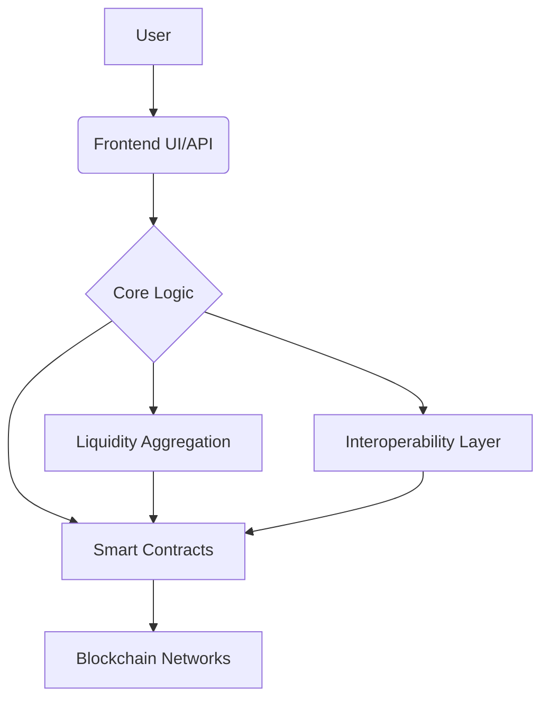

 <!-- Assuming LICENSE is in root -->
 <!-- Placeholder link -->

# AetherDEX Documentation

Welcome to the AetherDEX documentation. This guide provides comprehensive information about the AetherDEX decentralized exchange platform, designed for cross-chain DeFi interactions.

## About AetherDEX

AetherDEX is a next-generation decentralized exchange focused on providing fast, secure, and accessible trading across multiple blockchains. Our platform features advanced order routing, minimal fees, comprehensive cross-chain support, and a unique architecture combining the best aspects of order book and AMM models.

## Table of Contents

- [**User Guide**](./user-guide/index.md)
    - [Getting Started](./user-guide/getting-started.md)
    - [Trading Features](./user-guide/trading.md)
    - [Wallets and Security](./user-guide/wallets-security.md)
    - [Liquidity Provision](./user-guide/providing-liquidity.md)
    - [Frequently Asked Questions](./user-guide/faq.md)
- [**Architecture**](./architecture/README.md)
    - [Foundational Principles](./architecture/principles.md)
    - [System Overview](./architecture/overview.md)
    - [Multi-Provider Strategy](./architecture/multi-provider.md)
    - [Liquidity Access](./architecture/liquidity-access.md)
    - [Security Design](./architecture/security.md)
- [**Technical Deep Dive**](./technical/README.md) <!-- Renamed section -->
    - [Overview](./technical/deep-dive.md#aetherrouter-contract) <!-- Link to specific section -->
    - [AetherRouter Contract](./technical/router-contract.md) <!-- Keep specific file if exists -->
    - [Interoperability Architecture](./technical/interoperability.md) <!-- Keep specific file if exists -->
    - [Liquidity Sources & Aggregation](./technical/deep-dive.md#liquidity-sources-and-aggregation) <!-- Link to specific section -->
- [**API Reference**](./api/README.md)
    - [REST API](./api/rest.md)
    - [WebSocket API](./api/websocket.md)
    - [SDK Integration](./api/sdk.md)
- [**Contributing**](./contributing/README.md)
    - [How to Contribute](./contributing/guidelines.md)
    - [Code of Conduct](./contributing/code-of-conduct.md)
    - [Development Setup](./contributing/development.md)
    - [Pull Request Process](./contributing/pull-requests.md)

## Support

If you encounter issues or have questions, please visit our [Support Portal](https://support.aetherdex.io) or join our [Discord community](https://discord.gg/aetherdex).

## Contributing

We welcome contributions to improve AetherDEX and its documentation. Please see our [Contribution Guidelines](./contributing/README.md) for more information.
