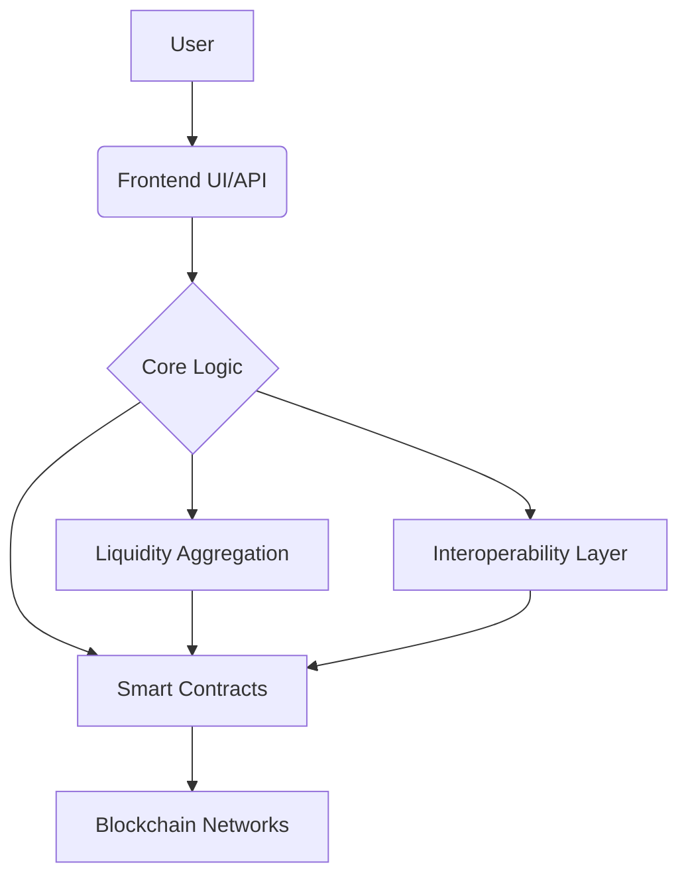

[](../LICENSE) <!-- Assuming LICENSE is in root -->
[](https://docs.aetherdex.io) <!-- Placeholder link -->

# AetherDEX Documentation

> **Status:** 🔄 Beta Development | **Version:** 0.8.0-beta | **Last Updated:** January 2025

Welcome to the comprehensive documentation for **AetherDEX**, a next-generation decentralized exchange built with advanced routing, Uniswap V4 integration, and modern full-stack architecture.



## 🏗️ Architecture Overview

### System Components

*   **Smart Contracts** - Advanced AetherRouter with multi-hop swaps, Uniswap V4 integration, and gas optimization (Solidity 0.8.24 + Foundry)
*   **Frontend Interface** - Modern Next.js 15 + React 19 trading interface with TypeScript and Tailwind CSS
*   **Backend Services** - Go-based API with Gin framework, PostgreSQL database, and Redis caching
*   **Infrastructure** - Docker containerization, monitoring, and production-ready deployment solutions

### Technology Stack

*   **Blockchain:** Ethereum, Uniswap V4 hooks, Layer 2 ready
*   **Smart Contracts:** Solidity 0.8.24, Foundry framework, OpenZeppelin
*   **Frontend:** Next.js 15, React 19, TypeScript, Tailwind CSS, Wagmi/Viem, Web3Modal
*   **Backend:** Go 1.25, Gin framework, GORM, JWT authentication
*   **Database:** PostgreSQL 15+, Redis 7+
*   **Package Management:** Bun (frontend), Go modules (backend)
*   **Infrastructure:** Docker, monitoring tools, nginx

## 📖 User Guide

### Getting Started

1.  **Connect Wallet** - Web3Modal integration with MetaMask, WalletConnect, and major wallet support
2.  **Token Swapping** - Advanced swap interface with token selection and amount input
3.  **Optimal Routing** - Multi-hop swaps with automatic path optimization and slippage protection
4.  **Real-time Updates** - Live price feeds and transaction status via WebSocket connections
5.  **Portfolio Tracking** - Monitor positions and transaction history (coming soon)

### Current Features (v0.8.0-beta)

*   ✅ **Token Swapping** - Core swap functionality with token selection
*   ✅ **Wallet Integration** - Web3Modal wallet connection
*   ✅ **Smart Routing** - Advanced AetherRouter with multi-hop optimization
*   ✅ **Real-time Data** - WebSocket price feeds and updates
*   🔄 **Liquidity Pools** - Pool management interface (in development)
*   🔄 **Advanced Trading** - Limit orders and advanced features (planned)
*   🔄 **Portfolio Dashboard** - Comprehensive portfolio tracking (planned)

### Trading Features

#### Currently Available
*   **Spot Trading** - Instant token swaps with AetherRouter optimization
*   **Multi-hop Routing** - Automatic path finding for best execution
*   **Slippage Protection** - Configurable slippage tolerance and MEV protection
*   **Gas Optimization** - Efficient contract design for minimal gas costs

#### In Development
*   **Limit Orders** - Advanced order types with automated execution
*   **Liquidity Provision** - Concentrated liquidity with Uniswap V4 integration
*   **Advanced Charts** - Technical analysis tools and market data visualization
*   **Portfolio Analytics** - Comprehensive tracking and performance metrics

## 🔧 API Reference

### REST Endpoints (Go Backend)

#### Authentication
```
POST   /api/auth/login         # User authentication
POST   /api/auth/refresh       # Refresh JWT token
POST   /api/auth/logout        # User logout
```

#### Trading API
```
GET    /api/v1/tokens          # List available tokens with metadata
GET    /api/v1/pairs           # Get trading pairs and liquidity info
POST   /api/v1/quote           # Get optimal swap quote with routing
POST   /api/v1/swap            # Execute swap transaction
GET    /api/v1/transactions    # Get transaction history
```

#### Market Data API
```
GET    /api/v1/prices          # Real-time token prices
GET    /api/v1/volume          # 24h trading volume by pair
GET    /api/v1/pools           # Liquidity pool information
GET    /api/v1/analytics       # Trading analytics and metrics
```

#### WebSocket API
```
ws://api/ws/prices          # Real-time price updates
ws://api/ws/trades          # Live trade notifications
ws://api/ws/pools           # Pool state changes
```

### Smart Contract Integration

#### AetherRouter Contract
```solidity
// Multi-hop swap with optimal routing
function swapExactTokensForTokens(
    uint256 amountIn,
    uint256 amountOutMin,
    SwapPath[] calldata path,
    address to,
    uint256 deadline
) external returns (uint256[] memory amounts);

// Get optimal swap quote
function getAmountsOut(
    uint256 amountIn,
    SwapPath[] calldata path
) external view returns (uint256[] memory amounts);
```

#### Integration Examples
- Frontend: Wagmi/Viem hooks for contract interaction
- Backend: Go-Ethereum client for blockchain monitoring
- Testing: Foundry test suite with 90%+ coverage

## 🧪 Testing

### Current Test Coverage

*   **Smart Contracts:** 85% coverage (✅ Target met)
*   **Frontend Components:** 45% coverage (🔄 Improving to 80%)
*   **Backend Services:** 30% coverage (🔄 Improving to 85%)
*   **Overall Project:** 65% coverage (🎯 Target: 80%)

### Running Tests

```bash
# Smart contract tests (Foundry)
cd backend/smart-contract
forge test
forge coverage

# Frontend tests (Vitest)
pnpm --filter aether-dex test
pnpm --filter aether-dex vitest run --coverage

# Backend tests (Go)
cd backend
go test ./...
go test -cover ./...

# Integration tests
make test-integration
```

### Test Improvement Plan

See [Test Coverage Report](./test-coverage-report.md) for detailed coverage status and [Test Coverage Improvement Plan](../.trae/documents/test_coverage_improvement_plan.md) for the 4-week improvement strategy to achieve 80%+ coverage.

## 🤝 Contributing

### Development Setup

1.  **Prerequisites:** 
    - Node.js 20+ with `pnpm` enabled via `corepack`
    - Go 1.25+
    - PostgreSQL 15+, Redis 7+
    - Docker & Docker Compose

2.  **Clone Repository:** `git clone https://github.com/your-org/aetherdex`

3.  **Install Dependencies:**
    ```bash
    # JavaScript/TypeScript workspace (frontend + shared packages)
    pnpm install
    
    # Backend
    cd backend
    go mod download
    
    # Smart Contracts
    cd backend/smart-contract
    forge install
    ```

4.  **Environment Setup:** 
    - Copy `.env.example` to `.env` in each component
    - Configure database connections and API keys

5.  **Start Development:**
    ```bash
    # Start all services
    make dev
    
    # Or individually:
    make dev-frontend    # Next.js dev server
    make dev-backend     # Go API server
    make dev-contracts   # Foundry local node
    ```

### Code Standards

*   **Frontend (TypeScript):** ESLint + Prettier + TypeScript strict mode
*   **Backend (Go):** gofmt + golangci-lint + go vet + staticcheck
*   **Smart Contracts (Solidity):** Foundry formatter + Slither analysis + Mythril
*   **Testing:** Minimum 80% coverage required for new features
*   **Documentation:** Update docs and comments with all changes
*   **Git:** Conventional commits, feature branches, PR reviews required

### Project Status

*   **Phase:** Beta Development (75% complete)
*   **Smart Contracts:** Advanced AetherRouter with 90% implementation
*   **Frontend:** Core swap interface with 70% completion
*   **Backend:** Go API with 80% core functionality
*   **Testing:** 65% overall coverage, improvement plan active
*   **Security:** Preparing for comprehensive audit
*   **Next Milestone:** Production-ready beta release

For detailed status, see [Project Status Report](../.trae/documents/project_status_report.md).

## About AetherDEX

AetherDEX is a next-generation decentralized exchange focused on providing fast, secure, and accessible trading across multiple blockchains. Our platform features advanced order routing, minimal fees, comprehensive cross-chain support, and a unique architecture combining the best aspects of order book and AMM models.

## Table of Contents

- [**User Guide**](./user-guide/index.md)
    - [Getting Started](./user-guide/getting-started.md)
    - [Trading Features](./user-guide/trading.md)
    - [Wallets and Security](./user-guide/wallets-security.md)
    - [Liquidity Provision](./user-guide/providing-liquidity.md)
    - [Frequently Asked Questions](./user-guide/faq.md)
- [**Architecture**](./architecture/README.md)
    - [Foundational Principles](./architecture/principles.md)
    - [System Overview](./architecture/overview.md)
    - [Multi-Provider Strategy](./architecture/multi-provider.md)
    - [Liquidity Access](./architecture/liquidity-access.md)
    - [Security Design](./architecture/security.md)
- [**Technical Deep Dive**](./technical/README.md) <!-- Renamed section -->
    - [Overview](./technical/deep-dive.md#aetherrouter-contract) <!-- Link to specific section -->
    - [AetherRouter Contract](./technical/router-contract.md) <!-- Keep specific file if exists -->
    - [Interoperability Architecture](./technical/interoperability.md) <!-- Keep specific file if exists -->
    - [Liquidity Sources & Aggregation](./technical/deep-dive.md#liquidity-sources-and-aggregation) <!-- Link to specific section -->
- [**API Reference**](./api/README.md)
    - [REST API](./api/rest.md)
    - [WebSocket API](./api/websocket.md)
    - [SDK Integration](./api/sdk.md)
- [**Contributing**](./contributing/README.md)
    - [How to Contribute](./contributing/guidelines.md)
    - [Code of Conduct](./contributing/code-of-conduct.md)
    - [Development Setup](./contributing/development.md)
    - [Pull Request Process](./contributing/pull-requests.md)

## Support

If you encounter issues or have questions, please visit our [Support Portal](https://support.aetherdex.io) or join our [Discord community](https://discord.gg/aetherdex).

## Contributing

We welcome contributions to improve AetherDEX and its documentation. Please see our [Contribution Guidelines](./contributing/README.md) for more information.
